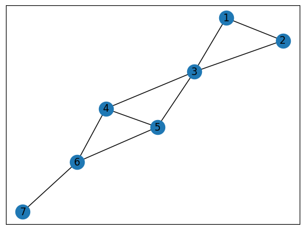
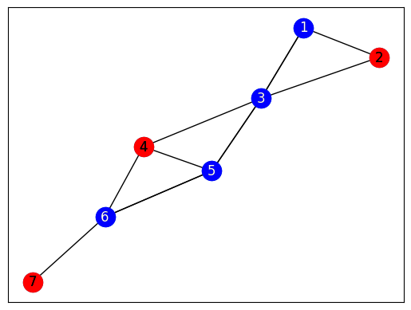

Demo of Antennas Selection
===========================
This code was taken from the webinar, *Quantum Programming with the Ocean Tools Suite*.

This is a graph representing antenna coverage. Each of the seven nodes below represents
an antenna with some amount of coverage. Note that the coverage provided by each
antenna is identical. The edges between each node represent antennas with overlapping
coverage.

Problem: Given the above set of antennas, which antennas should you choose such that
you maximize antenna coverage without any overlaps?

Solution: One possible solution is indicated by the red nodes below.

This problem is an example of an unconstrained optimization problem, known as the maximum independent set problem.  There are a wide variety of applications for this problem, such as scheduling and error correcting codes (as shown in [1]_).

Usage
-----
To run the demo:
::
  python antennas.py

To modify the program to consider a different set of antennas locations, modify the graph G.

Code Overview
-------------

The program ``antennas.py`` creates a graph using the Python package ``networkx``, and then uses the Ocean software tools to run the ``maximum_independent_set`` function from within the ``dwave_networkx`` package.

Further Information
-------------------
.. [1] S.Butenko and P.M. Pardalos. "Maximum independent set and related problems, with applications." PhD dissertationo, University of Florida, 2003.

.. [2] V.Goliber, "Quantum Programming with the Ocean Tools Suite", `www.youtube.com/watch?v=ckJ59gsFllU <https://www.youtube.com/watch?v=ckJ59gsFllU>`_

.. [3] A.Lucas, "Ising formulations of many NP problems", `doi: 10.3389/fphy.2014.00005 <https://www.frontiersin.org/articles/10.3389/fphy.2014.00005/full>`_

License
-------
Released under the Apache License 2.0. See `LICENSE <../LICENSE>`_ file.
