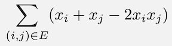
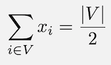
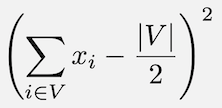
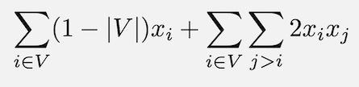
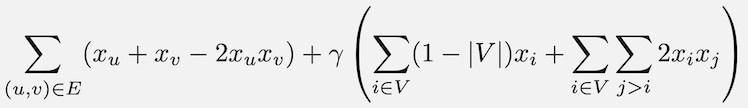

Graph Partitioning Demo
=======================
In this demo, we explore the graph partitioning problem.  This is an interesting problem from graph theory with a wide variety of applications (see e.g. [3]_).

For example, suppose that we have a group of people that we need to split into two equal-sized teams.  Between some pairs of people there is a friendly relationship.  We want to have as few friends on opposite teams as possible.  How can we solve this problem?

One way to solve this problem is with the graph partitioning problem.  If we think of our group of people as a graph (a node/vertex for each person), and draw an edge between people that are friends, we have a model of our network.  If we look for a minimum cut [4]_ in our graph, then we are looking for a way to split the nodes into two groups so that there are as few edges as possible between the groups.  In our group of peoople, this means that we have two teams with as few friends as possible on different teams.

We will run the demo to find the best way of splitting a 40-node graph (an Erdos-Renyi random graph that probabilistically creates an edge between 20% of its node pairs) into two subsets to minimize the number of cut edges.

Usage
-----
To run the demo, type:
::
  python graph_partitioning.py

After running, output will be printed to the command line that states whether or not the best (lowest energy) solution found is a valid partition that splits the graph into two sets of 20 nodes.  If the solution is valid (feasible), then the number of cut edges for that solution is displayed.

Code Overview
-------------
The code implements a QUBO formulation of this problem.

The answer that we are looking for is a partition of the nodes in the graph, so we will assign a binary variable for each node, i.e. variable ``x_i`` denotes whether node ``i`` is in one subset (call it Subset 0) or the other (Subset 1).

The objective function that we want should minimize the number of cut edges.  To count how many cut edges we have given a partition of the nodes (assignment of our binary variables), we start with a single edge.  The table below shows how we count the cut edges for a given graph partition (assignment of values to our binary variables). Columns :math:`x_i` and :math:`x_j` are two nodes; column edge (i, j) represents an edge between these two nodes.  We only want to count an edge if the endpoints are in different subsets, and so we assign a 1 for the edge column in this case and a 0 otherwise.

=== === ==========
x_i x_j edge (i,j)
--- --- ----------
0   0   0
0   1   1 
1   0   1
1   1   0
=== === ==========

From this table, we see that we can use the expression :math:`x_i+x_j-2x_ix_j` to calculate the edge column in our table.  Now for our entire graph, our objective function can be written as shown below, where the sum is over all edges in the graph, denoted by E.

Next we need to consider our constraint:  Subset 0 and Subset 1 must have the same sizes.  We can measure the size of Subset 1 by summing up our binary variables.  To ensure the two subsets have the same size, we enforce a constraint that Subset 1 has size equal to half of all nodes in the graph.  We first consider how to represent this constraint mathematically using our chosen binary variables, and use the following equality to represent our constraint, where V represents the set of all nodes in the graph.

For a QUBO, we need our constraints to be represented by mathematical expressions that are satisfied at their minimum value.  For this constraint, we can use the following expression that has a minimum value of 0 that occurs when Subset 1 has size exactly `|V|`/2.

To simplify this expression and determine the coefficients for our QUBO equation, we first multiply out the expression.

.. image:: readme_imgs/constraint_3.png

Next we can simplify this expression down to linear and quadratic terms for our QUBO.  Recall that for binary variables we can replace any squared term with a linear term (since 0^2=0 and 1^2=1), and we can remove any constant terms in our QUBO.  This results in the following final expression for our constraint.

To combine our objective and constraints into a single QUBO expression, we simply add together the objective function and our constraint (multiplied by gamma, the Lagrange parameter).  

In the code, we create the Q matrix for this QUBO as a dictionary iteratively, looping over the edges and nodes in our graph just as we see in the summation of our QUBO expression.

This demo generates an Erdos-Renyi random graph using the ``networkx`` package for our problem instance [1]_. There are three parameters to be set by the user in this code:  chain strength, number of reads, and gamma.  Since this is a relatively large problem, we set a large number of reads (``num_reads = 1000``).  

For chain strength, we examine the entries in our Q matrix and choose a relatively large number to enforce chains in our embedding.  For this problem, our largest matrix entries are the linear coefficients (approximately size ``gamma*(1-1*len(G.nodes))``) and so a value of ``gamma*len(G.nodes)`` is chosen on line 51 for ``chain_strength``.

For gamma, our Lagrange parameter, a good number to start with is an estimate for your optimal objective function value.  Since we are utilizing Erdos-Renyi random graphs, we assume that our graph will have about 20% of the number of cut edges that a complete graph would have (since our edge probability in G is also 20%).  Since a complete graph on 40 nodes has 780 edges, and any partition into equal subsets results in a cut of size 400 (20 nodes in each subset with all 20x20 edges between subsets cut), we can estimate our objective function value.  We are examining an Erdos-Renyi random graph with an edge probability of 20%, we can estimate a cut of size approximately 20% of 400, or 80 edges. This leads us to try a Lagrange parameter of 80, which is implemented in our program with ``gamma=80``.  

References
----------
.. [1] Aric A. Hagberg, Daniel A. Schult and Pieter J. Swart, “Exploring network structure, dynamics, and function using NetworkX”, in Proceedings of the 7th Python in Science Conference (SciPy2008), Gäel Varoquaux, Travis Vaught, and Jarrod Millman (Eds), (Pasadena, CA USA), pp. 11–15, Aug 2008 (https://networkx.github.io/documentation/stable/reference/generated/networkx.generators.random_graphs.gnp_random_graph.html#networkx.generators.random_graphs.gnp_random_graph)

.. [2] Andrew Lucas, "Ising formulations of many NP problems", `doi: 10.3389/fphy.2014.00005 <https://www.frontiersin.org/articles/10.3389/fphy.2014.00005/full>`_

.. [3] Hayato Ushijima-Mwesigwa, Christian FA Negre, and Susan M. Mniszewski, "Graph partitioning using quantum annealing on the D-Wave system." Proceedings of the Second International Workshop on Post Moores Era Supercomputing. ACM, 2017.

.. [4] Wikipedia contributors, "Minimum cut," Wikipedia, The Free Encyclopedia, https://en.wikipedia.org/w/index.php?title=Minimum_cut&oldid=907409652 (accessed August 18, 2019).

License
-------
Released under the Apache License 2.0. See `LICENSE <../LICENSE>`_ file.