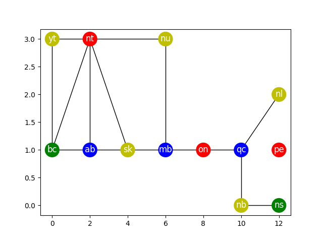

Colour Mapping Demo
===================
A demo on using the D-Wave Ocean SDK to solve the colour mapping problem. Namely,
given a map, colour the regions of the map such that no two regions sharing a
border would share the same colour.

  
  A graph representation of Canada's provinces. Provinces connected by edges share
  a border together. This is a sample output produced by this demo.

Usage
-----
Simply run the code with
::
  python colour_mapping.py

Code Overview
-------------
The idea is to describe the colour mapping problem in terms of constraints.
Once this is done, we can use tools from the Ocean SDK to convert these
constraints into a binary quadratic model (BQM), a type of equation that can be
ingested by the quantum computer. Afterwards, we will hopefully have a solution
to our colour mapping problem.

Constraints to describe the colour mapping problem:

* Each region can only select one colour
* No regions sharing a border can share a colour

Code Specifics
--------------
Why only four colours?
~~~~~~~~~~~~~~~~~~~~~~
* In the code, we let each of the regions choose one among four colours. Why
  are we limiting ourselves to only four colours? According to the `Four Colour
  Theorem <https://en.wikipedia.org/wiki/Four_color_theorem>`_, we need no more
  than four colours to colour any map such that no two adjacent regions share
  the same colour

License
-------
Released under the Apache License 2.0. See `LICENSE <../LICENSE>`_ file.
