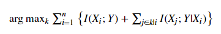

Demo of the MIQUBO Method of Feature Selection
==============================================
The demo illustrates the MIQUBO method by finding an optimal feature set for predicting
survival of Titanic passengers. It uses records provided in file
``formatted_titanic.csv``, which is a feature-engineered version of a public database of
passenger information recorded by the ship's crew (in addition to a column showing
survival for each passenger, it contains information on gender, title, class, port
of embarkation, etc). Its output is a ranking of subsets of features that have
high MI with the variable of interest (survival) and low redundancy.

Usage
-----
.. code-block:: bash

  python titanic.py

Code Overview
-------------
Statistical and machine-learning models use a set of input variables (features)
to predict output variables of interest. `Feature selection`_, which can be
part of the model design process, simplifies the model and reduces dimensionality by selecting,
from a given set of potential features, a subset of highly informative ones. One
statistical criterion that can guide this selection is `mutual information`_ (MI).

Ideally, to select the ``k`` most relevant features, you might maximize ``I(Xs; Y)``,
the MI between a set of ``k`` features, ``Xs``, and the variable of interest, ``Y``.
This is a hard calculation because the number of states is exponential with ``k``.

The Mutual Information QUBO (`MIQUBO`_\ ) method of feature selection formulates a quadratic
unconstrained binary optimization (QUBO) based on an approximation for ``I(Xs; Y)``,
which is submitted to the D-Wave quantum computer for solution.

.. _`Feature selection`: https://en.wikipedia.org/wiki/Feature_selection
.. _`mutual information`: https://en.wikipedia.org/wiki/Mutual_information

Code Specifics
--------------
.. _MIQUBO:
MIQUBO
~~~~~~
There are different methods of approximating the hard calculation of optimally selecting ``k`` of ``n`` features
to maximize MI. The approach followed here assumes conditional independence of features and limits
conditional MI calculations to permutations of three features. The optimal set of features is then
approximated by:

The left-hand component, ``I(Xi;Y)``, represents MI between the variable of interest and a particular
feature; maximizing selects features that best predict the variable of interest. The right-hand component,
``I(Xj;Y |Xi)``, represents conditional MI between the variable of interest and a feature given the
prior selection of another feature; maximizing selects features that complement information about the
variable of interest rather than provide redundant information.

This approximation is still a hard calculation. MIQUBO is a method for formulating it
for solution on the D-Wave quantum computer based on the 2014 paper,
`Effective Global Approaches for Mutual Information Based Feature Selection
<https://dl.acm.org/citation.cfm?id=2623611>`_, by Nguyen, Chan, Romano,
and Bailey published in the Proceedings of the 20th ACM SIGKDD international conference on knowledge
discovery and data mining.

References
----------
X. V. Nguyen, J. Chan, S. Romano, and J. Bailey,
"Effective global approaches for mutual information based feature selection",
`https://dl.acm.org/citation.cfm?id=2623611 <https://dl.acm.org/citation.cfm?id=2623611>`_

License
-------
Released under the Apache License 2.0. See `LICENSE <../LICENSE>`_ file.

