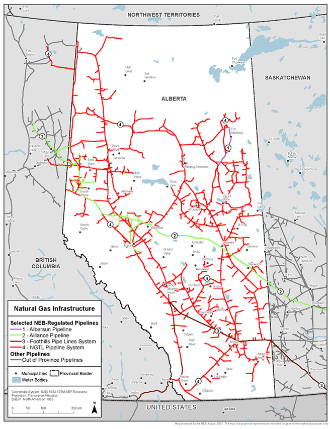
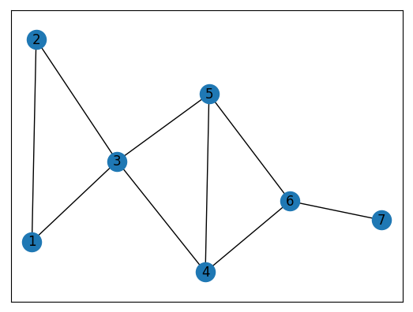
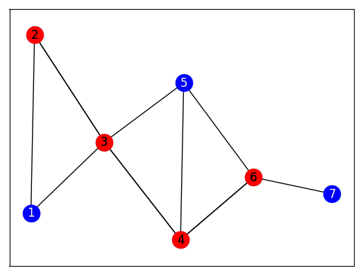

Pipelines Demo
=============

Pipeline networks can be viewed as a graph built up of edges (pipeline segments) and nodes (junctions of pipeline segments).  Suppose that within this network of pipelines, we want to determine a set of junctions from which we can monitor every pipeline segment.  This problem can be modeled as a vertex cover problem in which we want to find a subset of nodes in a graph such that every edge has at least one end point in our subset.

Let's look at a simple example.  Below we have a graph representing a simple network of pipelines with seven junctions.  Note that each junction is identical in terms of its utility as a monitoring location.

Problem: Given the above set of junctions, which ones should you choose such that you minimize the number selected for monitoring, while still monitoring every segment?

Solution: One possible solution is indicated by the red nodes below.

Usage
-----
To run the demo:
::
  python pipelines.py

References
----------

Image of Alberta pipelines from National Energy Board of Canada, <https://www.neb-one.gc.ca/nrg/ntgrtd/mrkt/nrgsstmprfls/ab-eng.html>

License
-------
Released under the Apache License 2.0. See `LICENSE <../LICENSE>`_ file.
